# Tài liệu rà soát logic nghiệp vụ HRM

## 1. Mục đích tài liệu

Tài liệu này giải thích hệ thống HRM hiện tại đang hoạt động như thế nào, logic nghiệp vụ đã hợp với một hệ thống quản trị nhân sự chưa, phần nào đang là demo, phần nào nên chỉnh tiếp để phù hợp với đề tài:

**Xây dựng hệ thống quản trị nhân sự tích hợp Agentic AI đánh giá năng lực**

Tài liệu tập trung vào các module chính:

- Đăng nhập và phân quyền
- Quản lý nhân viên
- Phòng ban và chức vụ
- Chấm công
- Nghỉ phép
- Lương thưởng
- Đánh giá năng lực bằng AI
- Chatbot/AI Assistant
- Dashboard và báo cáo

## 2. Kết luận rà soát nhanh

Hệ thống hiện tại **đúng hướng HRM**, vì đã có các nghiệp vụ cốt lõi của quản trị nhân sự:

- Quản lý hồ sơ nhân viên
- Quản lý phòng ban, chức vụ
- Theo dõi chấm công
- Quản lý nghỉ phép
- Tính và xử lý lương
- Đánh giá năng lực nhân viên
- Trợ lý AI hỗ trợ tra cứu nghiệp vụ

Tuy nhiên mức độ hoàn thiện chưa đồng đều:

| Module | Mức hiện tại | Nhận xét |
|---|---|---|
| Đăng nhập | Demo frontend + backend có JWT | UI chưa nối login thật với API |
| Nhân viên | Đã ghép API và đọc được DB thật `chatbot_hrm` | Hợp HRM ở mức hồ sơ cơ bản, nhưng DB chưa có CCCD/lương/role trong bảng `employees` |
| Phòng ban/chức vụ | Có API danh mục và đã map đúng schema thật | DB dùng `department_id/department_name`, `position_id/position_name` |
| Chấm công | Có API check-in/check-out nhưng schema DB thật còn đơn giản | DB hiện có `attendance_id`, `work_date`, `check_in`, `check_out`; chưa có cột đi trễ/về sớm/trạng thái |
| Nghỉ phép | Backend có API nhưng schema DB thật khác thiết kế cũ | DB hiện dùng `leave_type` dạng text, chưa có bảng `leave_types` |
| Lương thưởng | Backend có API đơn giản, frontend còn hard-code | DB thật dùng bảng `salary`, chưa phải `payroll` như tài liệu cũ |
| Đánh giá năng lực | Đã có API + UI + công thức điểm | Phù hợp để thể hiện AI hỗ trợ quyết định |
| Chatbot | FAQ demo | Hỗ trợ hỏi đáp, chưa phải Agentic AI thật |
| Dashboard | Hard-code | Cần lấy số liệu thật từ API |

Kết luận: nếu bảo vệ đồ án, nên nói hệ thống gồm **HRM core** và một module nâng cao là **Agentic AI đánh giá năng lực**. Phần AI hiện tại là rule-based AI, tức là hệ thống tự tổng hợp dữ liệu và đưa khuyến nghị theo luật nghiệp vụ.

## 3. Vai trò người dùng trong hệ thống

### 3.1. Admin/HR

Admin hoặc HR có quyền:

- Quản lý danh sách nhân viên
- Thêm/sửa thông tin nhân viên
- Chuyển nhân viên sang trạng thái đã nghỉ việc
- Xem, duyệt và xử lý lương
- Xem, duyệt và từ chối đơn nghỉ phép
- Theo dõi chấm công
- Xem báo cáo và đánh giá năng lực
- Sử dụng AI Assistant để hỏi nhanh nghiệp vụ

### 3.2. Nhân viên

Nhân viên có thể:

- Xem dashboard cá nhân
- Chấm công
- Gửi đơn nghỉ phép
- Xem lương cá nhân
- Xem hồ sơ cá nhân
- Chat với AI Assistant

### 3.3. Quản lý phòng ban

Trong nghiệp vụ HRM chuẩn, vai trò quản lý phòng ban nên có quyền:

- Xem nhân viên thuộc phòng ban của mình
- Đánh giá hoặc đề xuất đánh giá năng lực
- Duyệt bước đầu đơn nghỉ phép
- Theo dõi chấm công và hiệu suất của nhân viên thuộc phòng ban

Hiện tại hệ thống mới có role dạng `ADMIN`, `HR`, `MANAGER`, `EMPLOYEE`, nhưng frontend chưa phân quyền chi tiết theo vai trò.

## 4. Luồng tổng quát hệ thống

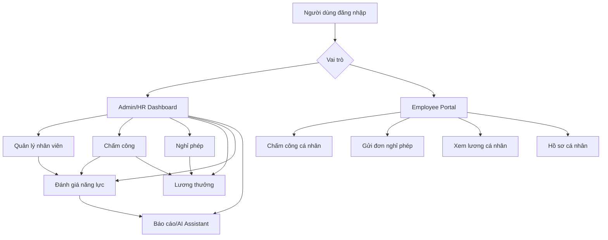

Ý nghĩa nghiệp vụ:

- Nhân viên là dữ liệu gốc.
- Chấm công và nghỉ phép tạo dữ liệu vận hành hằng ngày.
- Lương thưởng sử dụng hồ sơ nhân viên, công làm, phụ cấp, thưởng và khấu trừ.
- Đánh giá năng lực sử dụng dữ liệu nhân viên và chấm công để tính điểm.
- AI Assistant giúp giải thích, tra cứu hoặc đề xuất hướng xử lý.

## 5. Logic nghiệp vụ quản lý nhân viên

### 5.1. Mục tiêu

Module quản lý nhân viên dùng để quản lý hồ sơ nhân sự trong doanh nghiệp.

Thông tin quan trọng:

- Họ tên
- Email đăng nhập
- Số điện thoại
- Phòng ban
- Chức vụ
- Trạng thái làm việc

Trong DB thật hiện tại, bảng `employees` đang có các cột:

```text
employee_id
user_id
full_name
email
phone
department_id
position_id
hire_date
status
```

Các thông tin như `cccd`, `salary_base`, `role`, `password` **chưa nằm trực tiếp trong bảng `employees`**. Backend hiện đã tạm map các trường này theo dạng mặc định/không lưu bền để UI không lỗi.

### 5.2. Luồng thêm nhân viên

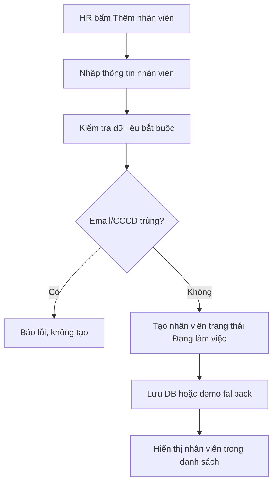

Logic hiện tại:

- Frontend kiểm tra bắt buộc: họ tên, email, CCCD, phòng ban, chức vụ.
- CCCD đang là trường UI mong muốn, nhưng DB thật chưa có cột `cccd`, nên chưa lưu bền.
- Email được kiểm tra trùng ở frontend/backend ở mức code.
- Backend kiểm tra trùng email với DB thật.
- Nhân viên mới trên UI mặc định là `Đang làm việc`; backend chuyển sang `active` khi ghi xuống DB.

Điểm hợp HRM:

- Có hồ sơ nhân viên rõ ràng.
- Có trạng thái làm việc.
- Xóa nhân viên theo kiểu soft delete sang `Đã nghỉ việc`, phù hợp hơn xóa cứng.
- Có phòng ban, chức vụ, vai trò và lương cơ bản.

Điểm chưa hợp HRM hoặc cần chỉnh:

- `CCCD`, `salary_base`, `role` trong model backend hiện đang không map vào DB thật vì bảng `employees` chưa có các cột này.
- Email nên unique ở database, không chỉ check trong code.
- CCCD cũng nên unique ở database.
- Tài khoản đăng nhập thật nên liên kết qua bảng `users` thay vì lưu password trực tiếp trong `employees`.
- Role `ADMIN` hoặc `Quản trị hệ thống` nên chỉ có một account hoặc được tạo bằng seed riêng, không cho tạo tự do từ form nhân viên.
- Chuyển nghỉ việc nên lưu thêm ngày nghỉ việc và lý do nghỉ việc.

### 5.3. Luồng sửa nhân viên

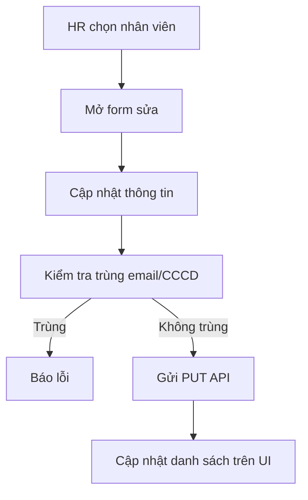

Logic hiện tại:

- Sửa hồ sơ không yêu cầu nhập lại mật khẩu.
- Khi đổi phòng ban, chức vụ được reset để tránh chức vụ không khớp.
- Vai trò chỉ nên giới hạn ở `Nhân viên` và `Quản lý`.

Điểm nên bổ sung:

- Ghi lịch sử thay đổi quan trọng: đổi phòng ban, đổi chức vụ, đổi lương.
- Không cho sửa email nếu email đang dùng để đăng nhập mà chưa có xác nhận.
- Nếu đổi lương cơ bản, nên lưu ngày hiệu lực.

### 5.4. Luồng cho nghỉ việc

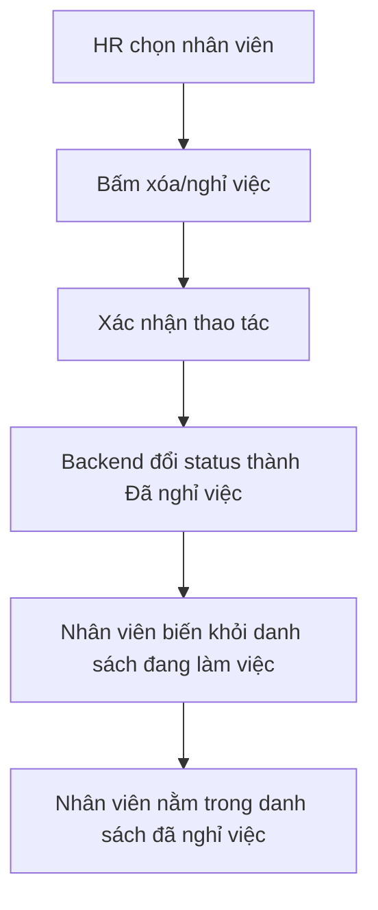

Logic này hợp HRM hơn xóa cứng, vì doanh nghiệp cần giữ lại dữ liệu quá khứ để đối soát lương, nghỉ phép, chấm công và báo cáo.

## 6. Logic phòng ban và chức vụ

### 6.1. Mục tiêu

Phòng ban và chức vụ là danh mục nền để phân loại nhân viên.

Ví dụ:

| Phòng ban | Chức vụ phù hợp |
|---|---|
| IT | Developer, Team Lead, QA Tester, DevOps Engineer |
| HR | HR Manager, HR Staff |
| Marketing | Marketing Manager, Marketing Executive, Content Writer |
| Sales | Sales Manager, Sales Executive, Sales Representative |
| Accounting | Chief Accountant, Accountant |

### 6.2. Logic hiện tại

- Backend có API lấy danh sách phòng ban.
- Backend có API lấy danh sách chức vụ.
- Backend đã map đúng schema DB thật:
  - `departments.department_id` -> `id`
  - `departments.department_name` -> `name`
  - `positions.position_id` -> `id`
  - `positions.position_name` -> `title`
- Frontend vẫn có fallback map chức vụ theo tên phòng ban để demo lựa chọn chức vụ.

### 6.3. Điểm cần chỉnh để hợp HRM

Nên thêm quan hệ `department_id` vào bảng `positions`.

Logic đúng nên là:

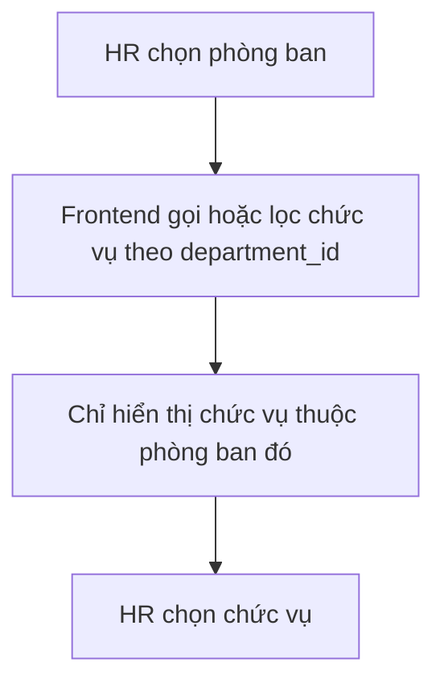

Lợi ích:

- Không phải hard-code chức vụ trong frontend.
- Dễ thêm phòng ban/chức vụ mới.
- Dữ liệu nhất quán giữa UI và database.

## 7. Logic chấm công

### 7.1. Mục tiêu

Chấm công dùng để ghi nhận thời gian làm việc, đi trễ, về sớm và số giờ làm thực tế.

### 7.2. Luồng check-in/check-out hiện tại

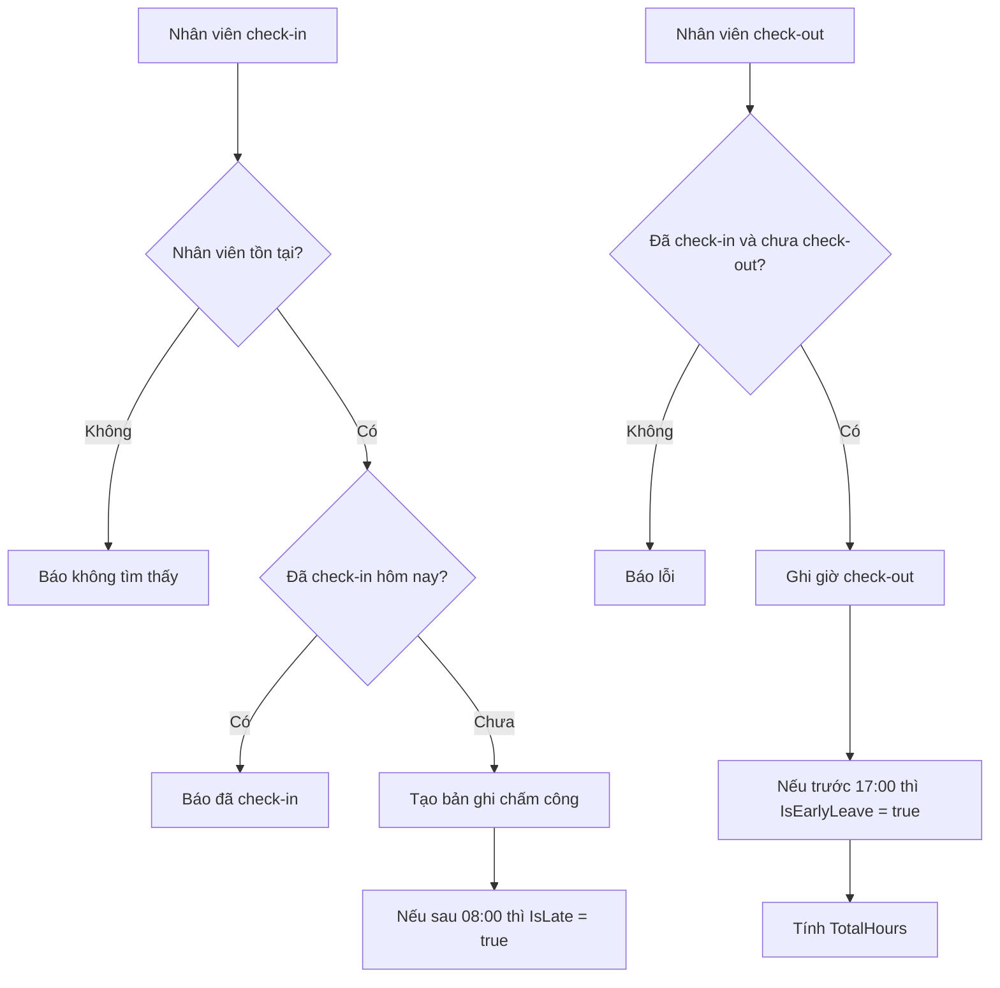

Logic hiện tại:

- Check-in sau 08:00 bị tính đi trễ.
- Check-out trước 17:00 bị tính về sớm.
- Sau check-out, trạng thái thành `Completed`.
- Nếu chưa check-out, trạng thái là `Working`.
- Có API xem danh sách chấm công theo ngày, summary theo ngày và báo cáo tháng.

Điểm hợp HRM:

- Có dữ liệu giờ vào, giờ ra, đi trễ, về sớm.
- Có tổng giờ làm theo ngày.
- Có báo cáo tháng theo nhân viên.

Điểm cần chỉnh:

- Chưa tự sinh bản ghi `Absent` cho nhân viên không check-in.
- Chưa có ca làm việc linh hoạt, ví dụ ca sáng, ca chiều, remote.
- Chưa xử lý làm thêm giờ chính thức.
- Chưa có quy trình xin điều chỉnh công.
- Chưa liên kết trực tiếp vào tính lương frontend.

## 8. Logic nghỉ phép

### 8.1. Mục tiêu

Nghỉ phép dùng để nhân viên gửi yêu cầu nghỉ và HR/quản lý duyệt hoặc từ chối.

### 8.2. Luồng nghiệp vụ chuẩn

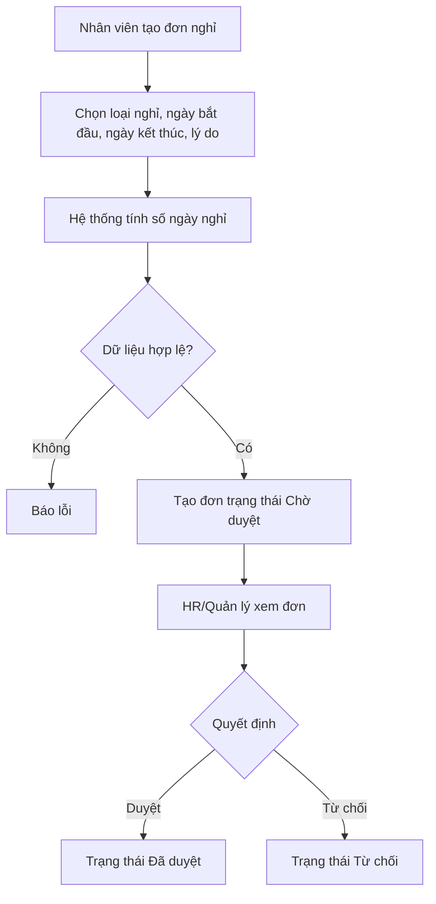

Logic backend hiện tại:

- Tạo đơn từ `EmployeeId`, `LeaveTypeId`, `StartDate`, `EndDate`, `Reason`.
- Hỗ trợ định dạng ngày `yyyy-MM-dd` và `dd/MM/yyyy`.
- Nếu ngày kết thúc nhỏ hơn ngày bắt đầu thì báo lỗi.
- Tự tính `TotalDays = EndDate - StartDate + 1`.
- Trạng thái mặc định là `Chờ duyệt`.
- HR có thể duyệt sang `Đã duyệt` hoặc từ chối sang `Từ chối`.
- Dashboard nghỉ phép tính số đơn chờ duyệt, đã duyệt, từ chối và số người đang nghỉ hôm nay.

Logic frontend hiện tại:

- Màn `Leave.tsx` vẫn dùng dữ liệu hard-code.
- Tạo/duyệt/từ chối trên UI chỉ cập nhật state frontend, chưa gọi API thật.

Điểm cần chỉnh để hợp HRM:

- Nối frontend nghỉ phép với backend API.
- Thêm quỹ phép năm theo nhân viên.
- Khi duyệt nghỉ phép năm thì trừ quỹ phép.
- Không cho tạo đơn trùng ngày với đơn đã duyệt hoặc đang chờ duyệt.
- Không cho duyệt lại đơn đã duyệt/từ chối.
- Từ chối nên bắt buộc nhập lý do.
- Nghỉ không lương nên chuyển dữ liệu sang module lương để trừ lương.

## 9. Logic lương thưởng

### 9.1. Mục tiêu

Module lương dùng để tính, duyệt và thanh toán lương cho nhân viên theo tháng.

### 9.2. Luồng nghiệp vụ chuẩn

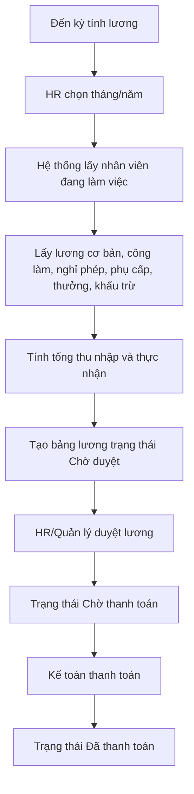

### 9.3. Logic backend hiện tại

Backend `SalaryService` có:

- `Dashboard(month, year)`: tổng lương, lương trung bình, tổng thưởng, số bảng lương chưa thanh toán.
- `GetAll(month, year, status)`: lấy danh sách bảng lương theo tháng/năm/trạng thái.
- `CalculateMonthly(month, year)`: tạo bảng lương cho nhân viên chưa có bảng lương tháng đó.
- `Approve(id)`: chuyển `Chờ duyệt` sang `Chờ thanh toán`.
- `Pay(id)`: chuyển `Chờ thanh toán` sang `Đã thanh toán`.

Công thức backend hiện tại:

```text
TotalSalary = SalaryBase + Bonus - Deductions
```

Nhưng khi tạo mới:

```text
Bonus = 0
Deductions = 0
TotalSalary = SalaryBase
Status = "Chờ duyệt"
```

### 9.4. Logic frontend hiện tại

Màn `Salary.tsx` đang dùng dữ liệu hard-code và tự tính:

- Lương cơ bản
- Phụ cấp
- OT
- Thưởng KPI/dự án/lễ tết
- BHXH, BHYT, BHTN
- Thuế TNCN
- Tạm ứng
- Phạt
- Lương thực nhận

Frontend có workflow:

```text
pending -> calculated -> approved -> paid
```

Trong khi backend dùng trạng thái tiếng Việt:

```text
Chờ duyệt -> Chờ thanh toán -> Đã thanh toán
```

### 9.5. Điểm cần chỉnh để hợp HRM

- Nối frontend lương với backend API.
- Đồng bộ trạng thái giữa frontend và backend.
- Chỉ tính lương cho nhân viên `Đang làm việc`.
- Nếu nhân viên nghỉ giữa tháng, cần tính theo ngày công thực tế.
- Lấy dữ liệu chấm công để tính ngày công và OT.
- Lấy nghỉ không lương để trừ lương.
- Không cho tính lại bảng lương đã thanh toán.
- Có phiếu lương cá nhân cho nhân viên.
- Lưu lịch sử duyệt và người duyệt.

## 10. Logic đánh giá năng lực tích hợp AI

### 10.1. Mục tiêu

Module đánh giá năng lực là phần quan trọng nhất để làm rõ đề tài có AI.

Mục tiêu:

- Tổng hợp dữ liệu HRM
- Tính điểm năng lực nhân viên
- Xếp loại nhân viên
- Nêu điểm mạnh, điểm cần cải thiện
- Đưa khuyến nghị cho HR

### 10.2. Nguồn dữ liệu

Backend `CompetencyService` đang lấy:

- Danh sách nhân viên đang làm việc
- Phòng ban
- Chức vụ
- Dữ liệu chấm công trong tháng

Hiện chưa lấy:

- KPI thật
- Kết quả công việc thật
- Đánh giá của quản lý
- Dữ liệu đào tạo
- Kỷ luật/vi phạm nội quy ngoài chấm công

### 10.3. Công thức hiện tại

Hệ thống tính 4 nhóm điểm:

| Nhóm điểm | Trọng số | Ý nghĩa |
|---|---:|---|
| Chuyên cần | 30% | Đi làm đều, đúng giờ, ít thiếu công |
| Hiệu suất | 35% | Mức độ hoàn thành công việc |
| Kỹ năng | 20% | Mức phù hợp kỹ năng theo phòng ban/chức vụ |
| Kỷ luật | 15% | Tuân thủ quy định, ít đi trễ/về sớm |

Công thức:

```text
TotalScore =
  AttendanceScore * 0.30
+ PerformanceScore * 0.35
+ SkillScore * 0.20
+ DisciplineScore * 0.15
```

### 10.4. Cách tính từng điểm

#### Điểm chuyên cần

Nếu không có dữ liệu chấm công:

```text
AttendanceScore = 75
```

Nếu có dữ liệu:

```text
AttendanceScore = 100
  - số lần đi trễ * 4
  - số lần về sớm * 3
  - số bản ghi chưa Completed * 2
```

Điểm được giới hạn từ 0 đến 100.

#### Điểm hiệu suất

Hiện tại chưa có KPI thật, nên hệ thống dùng điểm mô phỏng:

```text
baseline = 78 + (employeeId % 6) * 3
```

Sau đó cộng/trừ theo điểm chuyên cần:

- Nếu chuyên cần >= 90: cộng 5
- Nếu chuyên cần < 70: trừ 6

Điểm này hợp để demo, nhưng chưa phải hiệu suất thật.

#### Điểm kỹ năng

Hệ thống dựa vào tên chức vụ và phòng ban:

- Manager/Lead/Trưởng: cộng điểm
- Developer/IT/DevOps/QA: cộng điểm
- HR/Nhân sự: cộng điểm
- Sales/Marketing: cộng điểm

Đây là rule-based, chưa phải đánh giá kỹ năng thật.

#### Điểm kỷ luật

Nếu không có dữ liệu chấm công:

```text
DisciplineScore = 80
```

Nếu có dữ liệu:

```text
DisciplineScore = 96 - số lỗi chấm công * 5
```

Lỗi chấm công gồm:

- Đi trễ
- Về sớm
- Trạng thái khác `Completed`

### 10.5. Xếp loại

| Tổng điểm | Xếp loại |
|---:|---|
| >= 90 | Xuất sắc |
| >= 80 | Tốt |
| >= 65 | Trung bình |
| < 65 | Cần cải thiện |

### 10.6. Luồng AI đánh giá năng lực

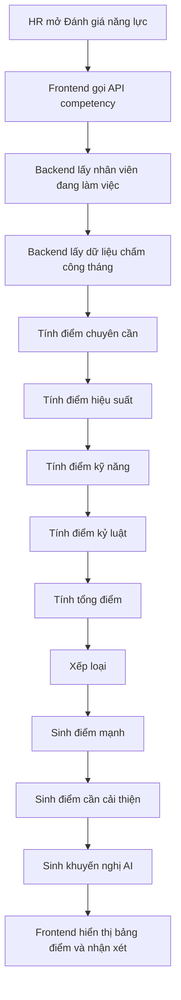

### 10.7. Vì sao gọi là AI/Agentic AI?

Hiện tại module này có thể gọi là:

**AI hỗ trợ đánh giá năng lực nhân sự theo luật nghiệp vụ**

Lý do:

- Hệ thống tự thu thập dữ liệu từ HRM.
- Hệ thống tự tính điểm.
- Hệ thống tự xếp loại.
- Hệ thống tự tạo nhận xét và khuyến nghị.

Nếu muốn gọi là **Agentic AI** mạnh hơn, nên bổ sung các bước:

- AI tự phát hiện nhân viên cần theo dõi.
- AI tạo kế hoạch hành động, ví dụ đào tạo, mentoring, cảnh báo đi trễ.
- AI nhắc HR thực hiện hành động.
- AI theo dõi kết quả tháng sau.
- AI giải thích lý do vì sao đưa ra khuyến nghị.

Ví dụ luồng Agentic AI nâng cấp:

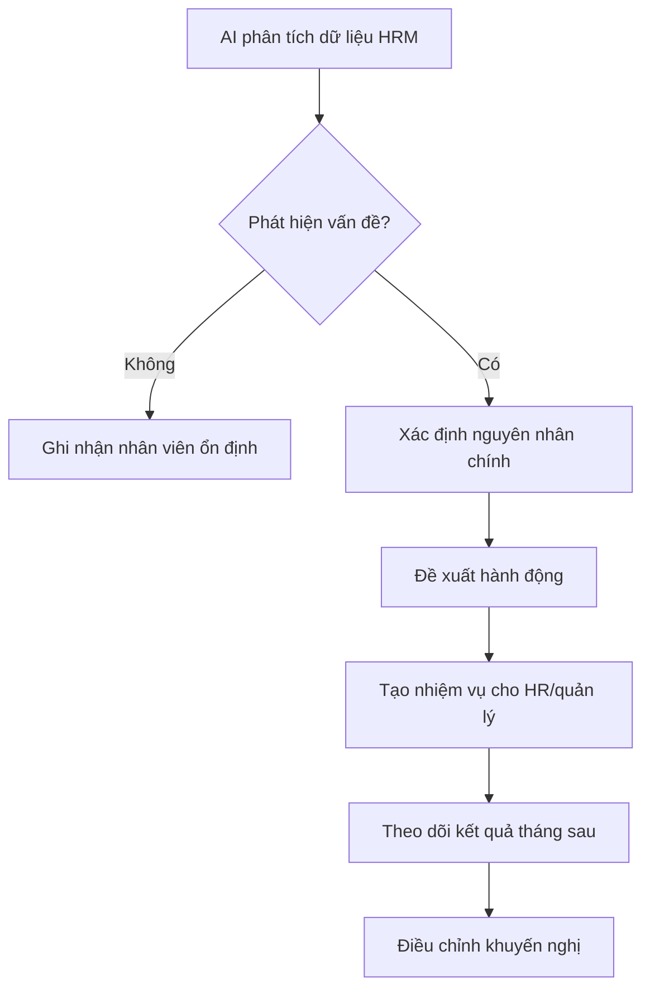

## 11. Logic Chatbot/AI Assistant

### 11.1. Logic hiện tại

Backend `ChatController` lưu session chat trong memory.

Chatbot trả lời theo keyword:

- Năng lực/đánh giá/agentic
- Lương
- Nghỉ phép
- Chấm công
- Nhân viên
- Báo cáo

### 11.2. Điểm hợp HRM

- Có trợ lý hỏi đáp nhanh cho nghiệp vụ nhân sự.
- Có session chat, lịch sử chat trong phiên backend đang chạy.

### 11.3. Điểm cần chỉnh

- Session chat đang lưu memory, restart backend là mất.
- Chưa gọi mô hình AI thật.
- Chưa truy vấn dữ liệu HRM thật theo câu hỏi.
- Chưa có quyền truy cập dữ liệu theo vai trò.

Nếu muốn nâng cấp:

- Lưu chat vào database.
- Cho AI gọi tool/API nội bộ như xem lương, xem đơn nghỉ, xem điểm năng lực.
- Phân quyền: nhân viên chỉ hỏi dữ liệu của mình, HR hỏi dữ liệu toàn công ty.

## 12. Logic đăng nhập và phân quyền

### 12.1. Backend hiện tại

Backend có API:

```text
POST /api/admin/auth/login
POST /api/admin/auth/forgot-password
```

Login kiểm tra:

- Email
- Password bằng BCrypt
- Sinh JWT token
- Gắn role vào token

### 12.2. Frontend hiện tại

Frontend `Login.tsx` đang là demo:

- Quick login Admin
- Quick login Nhân viên
- Email/password demo:
  - `admin@company.com / admin123`
  - `employee@company.com / emp123`

Frontend chưa gọi API login thật.

### 12.3. Điểm cần chỉnh

- Nối frontend login với `/api/admin/auth/login`.
- Lưu token vào localStorage hoặc cookie.
- Gửi token trong header:

```text
Authorization: Bearer {token}
```

- Bảo vệ API quản trị bằng `[Authorize]`.
- Phân quyền theo role:
  - ADMIN: toàn quyền
  - HR: quản lý nhân sự, nghỉ phép, lương, đánh giá
  - MANAGER: xem phòng ban, duyệt đề xuất
  - EMPLOYEE: xem dữ liệu cá nhân

## 13. Logic dashboard và báo cáo

### 13.1. Dashboard hiện tại

`Dashboard.tsx` đang dùng số liệu hard-code:

- Tổng nhân viên 125
- Tổng lương tháng này 2.1 tỷ
- Nghỉ phép hôm nay 7
- Hiệu suất trung bình 87%

### 13.2. Logic dashboard nên có

Dashboard nên lấy dữ liệu từ các module thật:

| Chỉ số | Nguồn dữ liệu |
|---|---|
| Tổng nhân viên | Employees status `Đang làm việc` |
| Nhân viên nghỉ việc | Employees status `Đã nghỉ việc` |
| Nghỉ phép hôm nay | LeaveRequests `Đã duyệt` và ngày hiện tại nằm trong khoảng nghỉ |
| Lương tháng | Payroll tháng/năm hiện tại |
| Đi trễ hôm nay | Bảng `attendance`, suy luận từ `check_in` nếu có quy định giờ vào |
| Điểm năng lực TB | Competency dashboard |

Luồng:

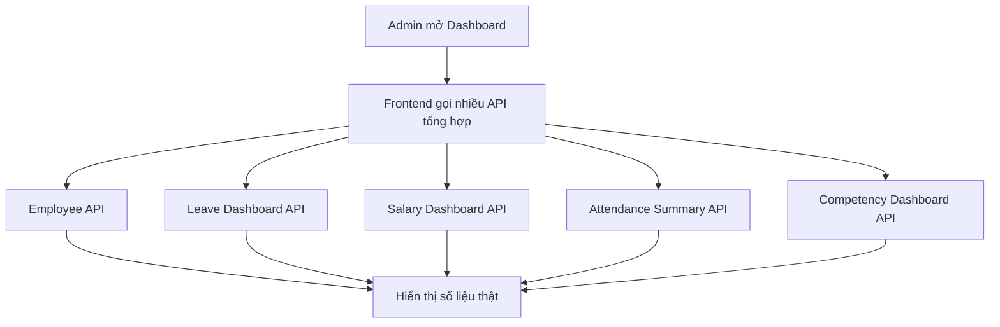

## 14. Mô hình dữ liệu nghiệp vụ nên có

### 14.1. Bảng chính

| Bảng | Ý nghĩa |
|---|---|
| employees | Hồ sơ nhân viên |
| departments | Phòng ban |
| positions | Chức vụ |
| attendance | Chấm công |
| leave_requests | Đơn nghỉ phép |
| salary | Bảng lương |
| competency_reviews | Kết quả đánh giá năng lực nên bổ sung |
| chat_sessions | Phiên chat nên bổ sung |
| chat_messages | Tin nhắn chat nên bổ sung |

### 14.2. Quan hệ nên có

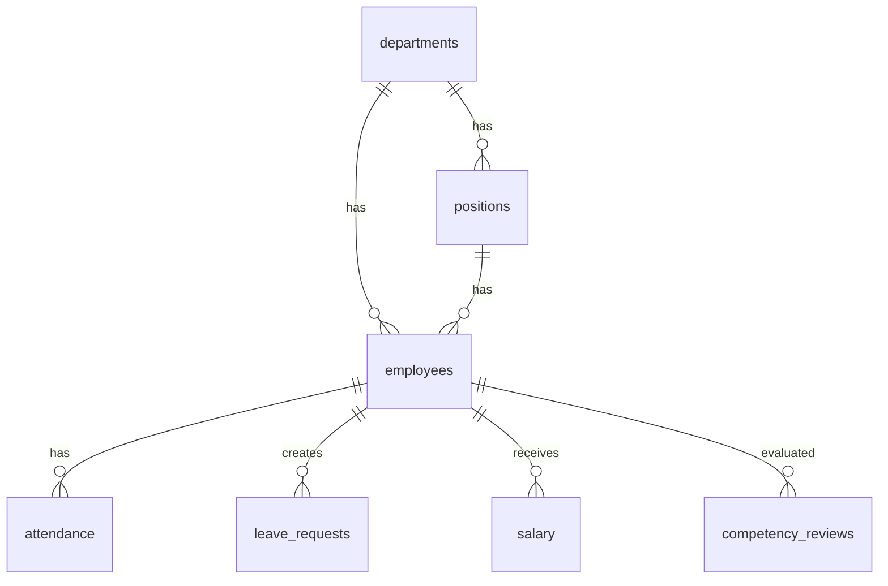

### 14.3. Cột nên bổ sung cho đúng HRM

`employees`:

- `cccd`
- `employee_code`
- `gender`
- `date_of_birth`
- `address`
- `hire_date`
- `resign_date`
- `resign_reason`
- `manager_id`

`positions`:

- `department_id`
- `level`
- `min_salary`
- `max_salary`

`leave_requests`:

- `reviewed_by`
- `reviewed_at`
- `review_note`

`salary`:

- `work_days`
- `overtime_hours`
- `allowance`
- `insurance_deduction`
- `tax_deduction`
- `approved_by`
- `paid_at`

`competency_reviews`:

- `employee_id`
- `month`
- `year`
- `attendance_score`
- `performance_score`
- `skill_score`
- `discipline_score`
- `total_score`
- `rating`
- `recommendation`

## 15. Các điểm chưa hợp HRM cần ưu tiên sửa

### Ưu tiên 1: Dữ liệu thật và phân quyền

- Nối login frontend với backend JWT.
- Bật `[Authorize]` cho API quản trị.
- Gửi token từ frontend khi gọi API.
- Không cho nhân viên xem dữ liệu người khác.

### Ưu tiên 2: Hoàn thiện nhân viên

- Thêm cột `cccd` vào MySQL.
- Thêm unique index cho email và CCCD.
- Hash password khi tạo nhân viên.
- Không cho tạo nhiều account quản trị hệ thống.
- Thêm ngày nghỉ việc và lý do nghỉ việc.

### Ưu tiên 3: Nối API cho lương và nghỉ phép

- `Leave.tsx` gọi API nghỉ phép thật.
- `Salary.tsx` gọi API lương thật.
- Đồng bộ trạng thái frontend/backend.
- Không để dữ liệu demo hard-code cho module chính.

### Ưu tiên 4: Làm rõ Agentic AI

- Lưu kết quả đánh giá năng lực theo tháng.
- Cho AI tạo danh sách nhân viên cần theo dõi.
- Có kế hoạch hành động: đào tạo, mentoring, cảnh báo chuyên cần.
- Có trạng thái xử lý khuyến nghị: mới, đang xử lý, hoàn thành.

### Ưu tiên 5: Dashboard thật

- Dashboard lấy số liệu từ API.
- Badge sidebar lấy số liệu thật.
- Báo cáo lấy từ database.

## 16. Kịch bản demo hợp lý khi bảo vệ

### Kịch bản 1: Quản lý nhân viên

1. HR đăng nhập.
2. Vào mục Nhân viên.
3. Thêm nhân viên mới.
4. Chọn phòng ban và chức vụ.
5. Nhập lương cơ bản.
6. Hệ thống kiểm tra email/CCCD.
7. Nhân viên xuất hiện trong danh sách đang làm việc.
8. Chuyển một nhân viên sang đã nghỉ việc.
9. Nhân viên biến khỏi danh sách chính và nằm trong popup đã nghỉ việc.

Ý nghĩa nghiệp vụ: HR quản lý vòng đời nhân viên từ lúc vào làm đến khi nghỉ việc.

### Kịch bản 2: Chấm công và nghỉ phép

1. Nhân viên check-in.
2. Hệ thống ghi giờ vào và kiểm tra đi trễ.
3. Nhân viên check-out.
4. Hệ thống tính tổng giờ làm.
5. Nhân viên gửi đơn nghỉ phép.
6. HR duyệt hoặc từ chối.

Ý nghĩa nghiệp vụ: hệ thống ghi nhận dữ liệu vận hành hằng ngày.

### Kịch bản 3: Tính lương

1. HR chọn tháng cần tính lương.
2. Hệ thống tạo bảng lương cho nhân viên.
3. HR duyệt lương.
4. Kế toán thanh toán.
5. Trạng thái chuyển sang đã thanh toán.

Ý nghĩa nghiệp vụ: dữ liệu nhân viên, công làm và phụ cấp được dùng để tạo bảng lương.

### Kịch bản 4: Agentic AI đánh giá năng lực

1. HR vào mục Đánh giá năng lực.
2. Hệ thống lấy nhân viên đang làm việc.
3. Hệ thống lấy dữ liệu chấm công tháng hiện tại.
4. AI tính điểm chuyên cần, hiệu suất, kỹ năng, kỷ luật.
5. AI xếp loại nhân viên.
6. AI đưa nhận xét điểm mạnh, điểm cần cải thiện.
7. HR dùng khuyến nghị để quyết định đào tạo, khen thưởng hoặc theo dõi.

Ý nghĩa nghiệp vụ: AI không thay HR ra quyết định, mà hỗ trợ HR có thêm căn cứ phân tích.

## 17. Cách giải thích ngắn gọn khi thuyết trình

Có thể nói:

> Hệ thống của nhóm em là một HRM gồm các nghiệp vụ quản lý nhân viên, nghỉ phép, chấm công, lương thưởng và đánh giá năng lực. Điểm khác biệt là hệ thống tích hợp module Agentic AI đánh giá năng lực. Module này tự tổng hợp dữ liệu nhân viên và chấm công, tính điểm theo các tiêu chí chuyên cần, hiệu suất, kỹ năng, kỷ luật, sau đó xếp loại và đưa ra khuyến nghị cho HR. Nhờ vậy HR có thêm cơ sở để ra quyết định đào tạo, khen thưởng hoặc theo dõi nhân viên.

Nếu giảng viên hỏi "AI ở đâu?", trả lời:

> AI nằm ở module Đánh giá năng lực và AI Assistant. Trong bản hiện tại, AI được triển khai theo hướng rule-based: hệ thống tự phân tích dữ liệu HRM theo công thức và luật nghiệp vụ để đưa nhận xét. Nếu phát triển tiếp, module này có thể nâng cấp thành Agentic AI thật bằng cách tự tạo kế hoạch hành động, nhắc HR xử lý và theo dõi kết quả ở tháng sau.

## 18. Kết luận

Logic hiện tại **có nền HRM**, nhưng để hệ thống chặt chẽ hơn cần ưu tiên:

1. Đồng bộ dữ liệu thật giữa frontend và backend.
2. Hoàn thiện phân quyền đăng nhập JWT.
3. Chuẩn hóa dữ liệu nhân viên, phòng ban, chức vụ.
4. Nối API thật cho lương và nghỉ phép.
5. Lưu kết quả đánh giá năng lực theo tháng.
6. Nâng AI từ nhận xét rule-based lên Agentic AI có hành động và theo dõi.

Với đồ án hiện tại, cách đặt tên phù hợp nhất là:

**Xây dựng hệ thống quản trị nhân sự tích hợp Agentic AI đánh giá năng lực**
