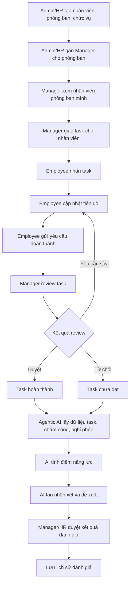

# Tài liệu nghiệp vụ Manager giao task và Agentic AI đánh giá năng lực

## 1. Mục tiêu

Tài liệu này mô tả hướng phát triển module **Agentic AI đánh giá năng lực** theo nghiệp vụ hợp lý hơn: không để AI tự suy đoán KPI, mà lấy dữ liệu từ **task do Manager giao**, kết hợp với chấm công, nghỉ phép và đánh giá của quản lý.

Mục tiêu chính:

- Manager giao task cho nhân viên thuộc phòng ban của mình.
- Nhân viên nhận task và cập nhật tiến độ.
- Manager kiểm tra, duyệt hoàn thành và chấm chất lượng task.
- Hệ thống lấy thêm dữ liệu chấm công, nghỉ phép, phòng ban, chức vụ.
- Agentic AI tổng hợp dữ liệu, tính điểm năng lực, nhận xét và đề xuất hành động.
- Manager/HR duyệt kết quả cuối cùng.

Điểm quan trọng: **AI không thay Manager ra quyết định**. AI chỉ hỗ trợ phân tích, giải thích và đề xuất.

## 2. Vai trò người dùng

| Vai trò | Quyền chính |
|---|---|
| Admin/HR | Quản lý toàn hệ thống, nhân viên, phòng ban, chức vụ, lương, nghỉ phép, chấm công, báo cáo tổng, chốt kết quả đánh giá |
| Manager | Quản lý nhân viên thuộc phòng ban mình, giao task, theo dõi tiến độ, duyệt task, chấm chất lượng, xem AI đánh giá |
| Employee | Nhận task, cập nhật tiến độ, gửi hoàn thành, xem task cá nhân |
| Agentic AI | Tổng hợp dữ liệu, tính điểm, xếp loại, nhận xét, đề xuất hành động |

## 3. Khác nhau giữa Admin/HR và Manager

| Chức năng | Admin/HR | Manager |
|---|---|---|
| Phạm vi dữ liệu | Toàn công ty | Chỉ phòng ban mình |
| Nhân viên | Thêm/sửa/nghỉ việc toàn bộ nhân viên | Chỉ xem nhân viên phòng ban mình |
| Phòng ban/chức vụ | Tạo, sửa, xóa | Không quản lý danh mục |
| Task | Có thể xem tổng quan | Giao task, theo dõi, duyệt task |
| Nghỉ phép | Duyệt/chốt cuối | Duyệt bước đầu hoặc đề xuất |
| Chấm công | Xem toàn công ty | Xem phòng ban mình |
| Lương | Tính, duyệt, thanh toán | Không xử lý lương chính |
| Đánh giá năng lực | Xem/chốt toàn hệ thống | Chấm/xác nhận nhân viên phòng ban |
| Báo cáo | Báo cáo toàn công ty | Báo cáo phòng ban |

## 4. Luồng nghiệp vụ tổng quát



## 5. Luồng Manager giao task

### 5.1. Manager chọn nhân viên

Manager chỉ được xem danh sách nhân viên thuộc phòng ban của mình.

Ví dụ:

```text
Manager: Trưởng phòng IT
Phòng ban: IT
Nhân viên có thể giao task: Nguyễn Văn A, Lê Văn B, Trần Văn C
```

### 5.2. Manager tạo task

Form tạo task gồm:

```text
Tên task
Mô tả task
Nhân viên được giao
Deadline
Mức độ ưu tiên
Điểm KPI/task point
Ghi chú yêu cầu
```

Ví dụ:

```text
Task: Sửa lỗi đăng nhập
Deadline: 3 ngày
Ưu tiên: Cao
Điểm KPI: 20
Người nhận: Nguyễn Văn A
```

### 5.3. Employee nhận task

Ở giao diện nhân viên, hệ thống hiển thị thông báo:

```text
Bạn có task mới
Tên task: Sửa lỗi đăng nhập
Deadline: 3 ngày
Trạng thái: Chưa bắt đầu
```

### 5.4. Employee cập nhật tiến độ

Nhân viên cập nhật phần trăm hoàn thành:

```text
0%   - Chưa bắt đầu
25%  - Đang phân tích
50%  - Đang thực hiện
75%  - Gần hoàn thành
100% - Gửi hoàn thành
```

Nhân viên có thể nhập ghi chú:

```text
Đã sửa xong backend, đang kiểm tra frontend.
```

### 5.5. Manager review task

Khi nhân viên gửi hoàn thành, Manager phải kiểm tra và chọn:

```text
Duyệt hoàn thành
Yêu cầu chỉnh sửa
Từ chối hoàn thành
```

Manager chấm thêm:

```text
Điểm chất lượng task: 0 - 100
Nhận xét Manager
```

Lưu ý nghiệp vụ: **nhân viên tự cập nhật 100% không có nghĩa task được tính hoàn thành**. Task chỉ hoàn thành chính thức khi Manager duyệt.

## 6. Liên kết với các module HRM khác

| Module | Liên kết với đánh giá năng lực |
|---|---|
| Nhân viên | Xác định ai được giao task và ai được đánh giá |
| Phòng ban | Giới hạn Manager chỉ quản lý nhân viên phòng ban mình |
| Chức vụ | Task và tiêu chí có thể khác nhau theo vị trí |
| Task | Nguồn chính để tính hiệu suất |
| Chấm công | Tính chuyên cần và kỷ luật |
| Nghỉ phép | Điều chỉnh deadline, tránh phạt sai khi nghỉ hợp lệ |
| Lương | Nhận kết quả đánh giá để đề xuất thưởng/tăng lương, không dùng lương để tính năng lực |
| AI Assistant | Giải thích điểm, trả lời câu hỏi về năng lực, gợi ý hành động |
| Báo cáo | Thống kê năng lực theo phòng ban, tuần, tháng |

## 7. Logic liên kết task với nghỉ phép và chấm công

### 7.1. Nghỉ phép ảnh hưởng deadline

Nếu nhân viên có đơn nghỉ phép đã duyệt trong thời gian làm task, hệ thống không nên phạt trễ deadline như bình thường.

Logic đề xuất:

```text
Deadline thực tế = deadline ban đầu + số ngày nghỉ phép đã được duyệt
```

Hoặc AI ghi nhận:

```text
Task trễ nhưng có nghỉ phép hợp lệ, không đánh giá kỷ luật nặng.
```

### 7.2. Chấm công không được phạt trùng với nghỉ phép

Logic đúng:

```text
Không check-in + có nghỉ phép đã duyệt -> hợp lệ
Không check-in + không có nghỉ phép -> ảnh hưởng chuyên cần/kỷ luật
```

### 7.3. Lương không phải nguồn tính năng lực

Không nên dùng:

```text
Lương cao -> năng lực cao
```

Logic đúng:

```text
Đánh giá năng lực -> đề xuất thưởng/tăng lương
```

## 8. Tiêu chí đánh giá năng lực mới

Với hướng task, bộ tiêu chí nên đổi thành:

| Tiêu chí | Trọng số | Nguồn dữ liệu |
|---|---:|---|
| Chuyên cần | 20% | Chấm công, nghỉ phép hợp lệ |
| Hiệu suất task | 40% | Task hoàn thành, tiến độ, đúng hạn |
| Kỹ năng/chất lượng | 25% | Điểm chất lượng task do Manager chấm |
| Kỷ luật/trách nhiệm | 15% | Tuân thủ deadline, cập nhật tiến độ, phản hồi task, chấm công |

Công thức:

```text
TotalScore =
  AttendanceScore * 0.20
+ TaskPerformanceScore * 0.40
+ QualitySkillScore * 0.25
+ DisciplineResponsibilityScore * 0.15
```

## 9. Cách tính từng tiêu chí

### 9.1. Chuyên cần

Dữ liệu lấy từ:

```text
attendance
leave_requests
```

Cách tính đề xuất:

```text
AttendanceScore = 100
  - số lần đi trễ * 4
  - số lần về sớm * 3
  - số ngày vắng không phép * 8
```

Nếu vắng nhưng có nghỉ phép được duyệt thì không trừ như vắng không phép.

### 9.2. Hiệu suất task

Dữ liệu lấy từ:

```text
tasks
task_progress_logs
task_reviews
```

Cách tính đề xuất:

```text
TaskPerformanceScore =
  tỷ lệ task hoàn thành * 50%
+ điểm đúng hạn * 30%
+ điểm tiến độ cập nhật * 20%
```

Ví dụ:

```text
Hoàn thành 4/5 task -> 80 điểm
Đúng hạn 3/4 task -> 75 điểm
Cập nhật tiến độ đầy đủ -> 90 điểm
```

### 9.3. Kỹ năng/chất lượng

Dữ liệu lấy từ điểm Manager chấm sau khi review task:

```text
quality_score
manager_review_note
```

Cách tính đề xuất:

```text
QualitySkillScore = trung bình quality_score của các task đã review
```

Ví dụ:

```text
Task 1: 85 điểm
Task 2: 90 điểm
Task 3: 80 điểm

QualitySkillScore = 85
```

### 9.4. Kỷ luật/trách nhiệm

Dữ liệu lấy từ:

```text
Deadline
Tiến độ cập nhật
Task bị yêu cầu sửa
Task quá hạn
Chấm công
```

Cách tính đề xuất:

```text
DisciplineResponsibilityScore = 100
  - task quá hạn * 6
  - task không cập nhật tiến độ * 4
  - task bị từ chối hoàn thành * 8
  - lỗi chấm công * 5
```

## 10. Xếp loại năng lực

| Tổng điểm | Xếp loại |
|---:|---|
| >= 90 | Xuất sắc |
| >= 80 | Tốt |
| >= 65 | Trung bình |
| < 65 | Cần cải thiện |

## 11. Agentic AI hoạt động như thế nào

Agentic AI trong module này hoạt động theo quy trình:

```text
Nhận mục tiêu: đánh giá năng lực nhân viên
    ↓
Lấy dữ liệu task, chấm công, nghỉ phép, phòng ban, chức vụ
    ↓
Phân tích từng tiêu chí
    ↓
Tính tổng điểm
    ↓
Xếp loại năng lực
    ↓
Tạo nhận xét
    ↓
Đề xuất hành động cho Manager/HR
```

Ví dụ đề xuất:

```text
Nhân viên có hiệu suất task tốt, hoàn thành đúng hạn nhiều task.
Đề xuất giao thêm task có độ khó cao hơn.
```

```text
Nhân viên thường xuyên cập nhật tiến độ trễ và có task quá hạn.
Đề xuất Manager trao đổi trực tiếp và theo dõi trong tuần tiếp theo.
```

```text
Nhân viên có chất lượng task thấp nhưng chuyên cần tốt.
Đề xuất đào tạo kỹ năng chuyên môn hoặc mentoring.
```

## 12. Dữ liệu database đề xuất

### 12.1. Bảng `tasks`

```text
task_id
title
description
assigned_by
assigned_to
department_id
deadline
priority
kpi_point
status
created_at
completed_at
```

`status` có thể gồm:

```text
new
in_progress
submitted
approved
revision_required
rejected
overdue
```

### 12.2. Bảng `task_progress_logs`

```text
log_id
task_id
employee_id
progress_percent
note
created_at
```

### 12.3. Bảng `task_reviews`

```text
review_id
task_id
reviewed_by
quality_score
review_note
result
reviewed_at
```

`result` có thể gồm:

```text
approved
revision_required
rejected
```

### 12.4. Bảng `competency_reviews`

```text
review_id
employee_id
period_type
start_date
end_date
attendance_score
task_performance_score
quality_skill_score
discipline_responsibility_score
total_score
rating
ai_recommendation
manager_note
approved_by
approved_at
```

## 13. API đề xuất

### 13.1. Manager task API

```http
GET    /api/manager/employees
GET    /api/manager/tasks
POST   /api/manager/tasks
GET    /api/manager/tasks/{id}
PUT    /api/manager/tasks/{id}
POST   /api/manager/tasks/{id}/review
```

### 13.2. Employee task API

```http
GET    /api/employee/tasks
POST   /api/employee/tasks/{id}/progress
POST   /api/employee/tasks/{id}/submit
```

### 13.3. Competency AI API

```http
GET    /api/admin/competency?startDate=...&endDate=...
GET    /api/manager/competency?startDate=...&endDate=...
GET    /api/manager/competency/{employeeId}/analyze?startDate=...&endDate=...
POST   /api/manager/competency/{employeeId}/approve
```

## 14. Giao diện Manager đề xuất

Manager nên có các màn hình:

```text
Dashboard phòng ban
Nhân viên phòng ban
Quản lý task
Duyệt task
Nghỉ phép phòng ban
Chấm công phòng ban
Đánh giá năng lực
AI Assistant
Báo cáo phòng ban
```

Nếu làm demo tối thiểu, nên ưu tiên:

```text
1. Dashboard phòng ban
2. Nhân viên phòng ban
3. Quản lý task
4. Duyệt task
5. Đánh giá năng lực
```

## 15. Giao diện Employee đề xuất

Employee nên có thêm màn hình:

```text
Task của tôi
```

Trong đó có:

```text
Task mới
Task đang làm
Task chờ duyệt
Task yêu cầu sửa
Task hoàn thành
Task quá hạn
```

Employee có thể:

```text
Xem chi tiết task
Cập nhật tiến độ
Gửi hoàn thành
Xem phản hồi của Manager
```

## 16. Kỳ đánh giá

Hệ thống nên hỗ trợ kỳ đánh giá linh hoạt:

```text
Theo tuần
Theo tháng
Theo quý
```

Đề xuất demo:

```text
Đánh giá theo tuần: cảnh báo sớm, theo dõi sát tiến độ.
Đánh giá theo tháng: tổng kết chính thức.
```

Ví dụ:

```text
Kỳ đánh giá: Tuần 2 - Tháng 6/2026
Thời gian: 08/06/2026 - 14/06/2026
Phòng ban: IT
Manager: Trưởng phòng IT
```

## 17. Kịch bản demo đề xuất

### Demo 1. Manager giao task

```text
1. Manager đăng nhập.
2. Vào màn Nhân viên phòng ban.
3. Chọn một nhân viên.
4. Bấm Giao task.
5. Nhập tên task, deadline, độ ưu tiên.
6. Hệ thống tạo task và gửi sang Employee Portal.
```

### Demo 2. Employee cập nhật task

```text
1. Employee đăng nhập.
2. Vào Task của tôi.
3. Thấy task mới.
4. Cập nhật tiến độ 50%.
5. Nhập ghi chú.
6. Khi hoàn thành, gửi yêu cầu hoàn thành.
```

### Demo 3. Manager duyệt task

```text
1. Manager vào Duyệt task.
2. Xem task nhân viên gửi hoàn thành.
3. Chấm chất lượng task.
4. Duyệt hoàn thành hoặc yêu cầu sửa.
```

### Demo 4. Agentic AI đánh giá năng lực

```text
1. Manager vào Đánh giá năng lực.
2. Chọn kỳ đánh giá tuần hoặc tháng.
3. AI lấy dữ liệu task, chấm công, nghỉ phép.
4. AI tính điểm năng lực.
5. AI tạo nhận xét và đề xuất.
6. Manager duyệt kết quả đánh giá.
```

## 18. Nội dung báo cáo cho TV3

Bạn có thể báo cáo:

> Em phụ trách phần Agentic AI và logic đánh giá năng lực. Sau khi phân tích lại nghiệp vụ, em đề xuất không để AI tự sinh KPI hoặc tự đánh giá nhân viên. Thay vào đó, hiệu suất sẽ lấy từ task do Manager giao. Manager chọn nhân viên trong phòng ban, tạo task, đặt deadline và mức độ ưu tiên. Nhân viên nhận task, cập nhật tiến độ và gửi hoàn thành. Manager kiểm tra, duyệt task và chấm chất lượng. Agentic AI sẽ tổng hợp dữ liệu task, chấm công, nghỉ phép, phòng ban và chức vụ để tính điểm năng lực. AI đưa ra nhận xét và đề xuất hành động, nhưng kết quả cuối cùng vẫn do Manager hoặc HR duyệt. Cách này giúp module AI liên kết chặt với các nghiệp vụ HRM, có nguồn dữ liệu rõ ràng và đúng logic quản lý nhân sự hơn.

## 19. Kết luận

Hướng **Manager giao task + Agentic AI đánh giá năng lực** hợp lý hơn KPI mô phỏng vì:

- KPI/hiệu suất có nguồn dữ liệu rõ ràng từ task.
- Manager có vai trò thật trong đánh giá.
- Employee không tự quyết định kết quả năng lực.
- AI liên kết được với nhân viên, phòng ban, chấm công, nghỉ phép và báo cáo.
- Kết quả đánh giá có thể dùng cho đào tạo, khen thưởng, theo dõi hoặc đề xuất tăng lương.

Đây là hướng nên dùng để phát triển tiếp module Agentic AI trong đề tài:

**Xây dựng hệ thống quản trị nhân sự tích hợp Agentic AI đánh giá năng lực**
